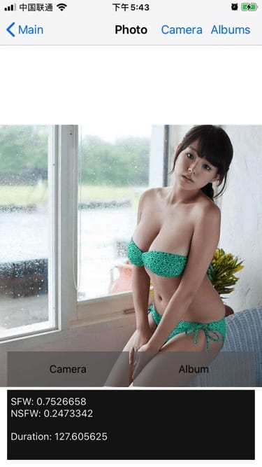
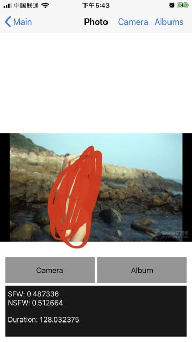
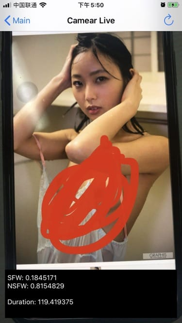

# IOS nsfw oc 版

### 最先找到 [open_nsfw_android](https://github.com/devzwy/open_nsfw_android), 里面有人实现了swift版 [open_nsfw_ios](https://github.com/davewang/open_nsfw_ios)。没找到oc版, 所以我尝试下oc版。

### Demo 运行效果

1. 图片识别效果

   <center class="half">
   
   
   </center>

2. 视频帧识别效果

   <center class="half">
   
   </center>


### 运行

1. tensorflow库有些许大，所以我忽略了pod文件夹，需要自己install.

   ```
   pod install --verbose
   ```

2. 工程目录Resource中需要自己放入`nsfw.tflite`模型文件. 下载地址: [nsfw.tflite](https://github.com/devzwy/open_nsfw_android/tree/dev/OpenNSFW/src/main/assets).

